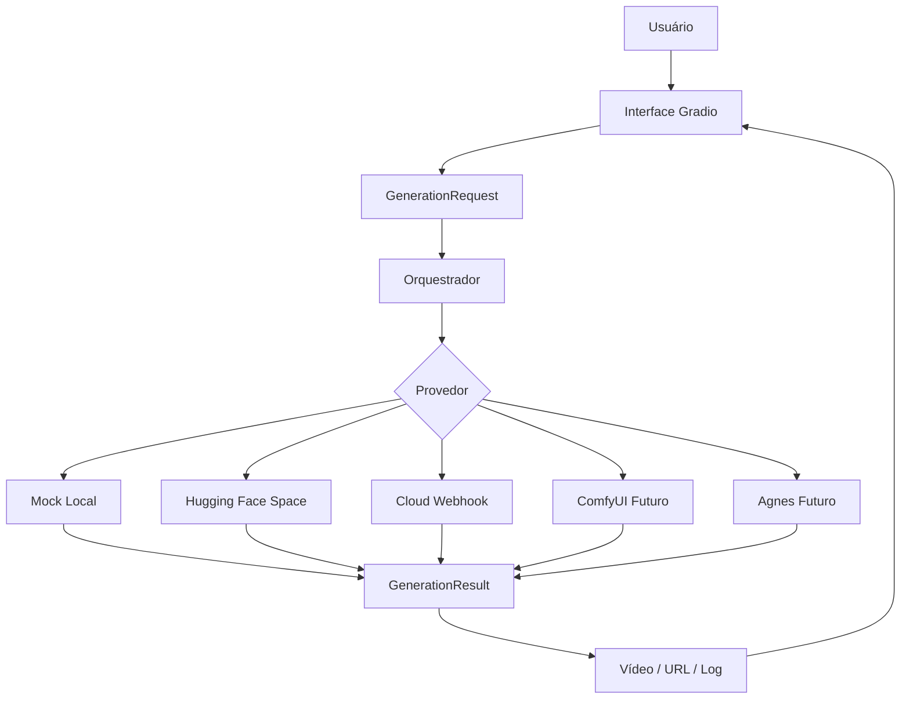

# Blueprint do Projeto — Video AI

## 1. Visão geral

O **Video AI** é uma interface GUI para gerar vídeos com inteligência artificial usando provedores em nuvem, modelos gratuitos/abertos e backends plugáveis.

A proposta é criar um painel simples onde o usuário possa:

1. escrever um prompt;
2. escolher um provedor/modelo;
3. enviar a geração para um backend local ou em nuvem;
4. visualizar o resultado;
5. reaproveitar presets, histórico e workflows no futuro.

O projeto começa como uma aplicação Python com **Gradio**, mas deve evoluir para um mini-estúdio de geração de vídeos com IA, com foco em praticidade, baixo custo e integração com provedores gratuitos quando disponíveis.

---

## 2. Problema que o projeto resolve

Hoje existem muitos modelos e provedores de vídeo por IA, mas eles estão espalhados entre:

- Hugging Face Spaces;
- Google Colab;
- Kaggle;
- ComfyUI;
- SwarmUI;
- WanGP;
- APIs pagas ou semi-gratuitas;
- demos temporárias;
- provedores com fila, cota ou crédito grátis.

O problema é que cada solução tem uma interface, configuração e formato de resposta diferente.

O **Video AI** resolve isso criando uma camada única de operação:

```txt
Usuário → GUI → Orquestrador → Provedor escolhido → Vídeo final
```

Assim, o usuário não precisa reescrever todo o fluxo quando trocar de modelo ou provedor.

---

## 3. Público-alvo

### Usuário principal

Criadores, designers, social media, comunicadores e equipes que precisam gerar vídeos curtos com IA, principalmente para:

- reels;
- vídeos institucionais;
- chamadas de eventos;
- vídeos de notícias;
- conteúdos internos;
- storyboards animados;
- testes rápidos de modelos.

### Perfil técnico esperado

O projeto deve atender dois níveis:

1. **Usuário comum:** usa a GUI, escreve prompt e gera vídeo.
2. **Usuário técnico:** adiciona provedores, adapta APIs e cria workflows.

---

## 4. Princípios do projeto

- **GUI em primeiro lugar:** a interface deve ser simples e visual.
- **Provedores plugáveis:** cada backend deve ser isolado em um adaptador.
- **Baixo custo:** priorizar camadas grátis, modelos abertos e uso sob demanda.
- **Sem dependência única:** o projeto não deve ficar preso a um só provedor.
- **Evolução gradual:** começar simples, depois adicionar histórico, presets e workflows.
- **Transparência:** sempre mostrar log, erro, provedor usado e resposta bruta quando possível.

---

## 5. Escopo do MVP

O MVP inicial tem como objetivo validar o fluxo completo de interface e provedores.

### Incluído no MVP

- Interface Gradio.
- Campo de prompt.
- Campo de prompt negativo.
- Upload opcional de imagem de referência.
- Escolha de provedor.
- Duração do vídeo.
- Resolução básica.
- Seed.
- Resultado em vídeo ou URL.
- Log em JSON.
- Provedor `mock` para teste local.
- Provedor `huggingface_space` para Hugging Face Spaces.
- Provedor `cloud_webhook` para APIs genéricas.

### Fora do MVP inicial

- Autenticação de usuários.
- Fila persistente.
- Banco de dados.
- Histórico visual.
- Galeria de vídeos.
- Edição de vídeo.
- Timeline.
- Integração completa com ComfyUI.
- Deploy final em produção.

---

## 6. Arquitetura geral



---

## 7. Camadas do sistema

### 7.1 Interface

Arquivo principal:

```txt
app.py
```

Responsabilidades:

- exibir a GUI;
- coletar prompt, configurações e imagem;
- chamar o orquestrador;
- exibir vídeo e log;
- manter o fluxo simples para o usuário final.

Componentes atuais:

- dropdown de provedor;
- campo de prompt;
- campo de prompt negativo;
- upload de imagem;
- duração;
- largura e altura;
- seed;
- botão de geração;
- player de vídeo;
- bloco de log JSON.

---

### 7.2 Configuração

Arquivo:

```txt
video_ai/config.py
```

Responsabilidades:

- carregar variáveis do `.env`;
- definir provedor padrão;
- guardar configurações do Hugging Face;
- guardar webhook cloud;
- definir porta e host do Gradio.

Variáveis principais:

```env
DEFAULT_PROVIDER=mock
HF_SPACE_ID=
HF_API_NAME=/predict
HF_TOKEN=
CLOUD_WEBHOOK_URL=
CLOUD_WEBHOOK_KEY=
GRADIO_SERVER_NAME=127.0.0.1
GRADIO_SERVER_PORT=7860
```

---

### 7.3 Orquestrador

Arquivo:

```txt
video_ai/orchestrator.py
```

Responsabilidades:

- registrar provedores disponíveis;
- escolher o provedor padrão;
- receber uma solicitação de geração;
- enviar a solicitação ao provedor correto;
- retornar um resultado padronizado para a interface.

Fluxo:

```txt
run_generation(provider_name, request)
```

---

### 7.4 Contrato de provedores

Arquivo:

```txt
video_ai/providers/base.py
```

Entidades principais:

#### GenerationRequest

Representa o pedido de geração.

Campos:

- `prompt`;
- `negative_prompt`;
- `image_path`;
- `duration_seconds`;
- `width`;
- `height`;
- `seed`;
- `extra`.

#### GenerationResult

Representa a resposta da geração.

Campos:

- `ok`;
- `message`;
- `video_path`;
- `video_url`;
- `raw`.

#### Provider

Contrato que todo provedor deve seguir:

```python
class Provider:
    name: str
    description: str

    def generate(self, request: GenerationRequest) -> GenerationResult:
        ...
```

---

## 8. Provedores atuais

### 8.1 MockProvider

Arquivo:

```txt
video_ai/providers/mock.py
```

Função:

- testar a interface sem chamar nenhuma API;
- salvar um `.txt` com o prompt enviado;
- validar se o fluxo interno está funcionando.

Uso recomendado:

```env
DEFAULT_PROVIDER=mock
```

---

### 8.2 HuggingFaceSpaceProvider

Arquivo:

```txt
video_ai/providers/huggingface_space.py
```

Função:

- chamar um Hugging Face Space compatível com `gradio_client`;
- enviar o prompt para uma rota como `/predict`;
- tentar interpretar a resposta como URL ou caminho de vídeo.

Uso recomendado:

```env
DEFAULT_PROVIDER=huggingface_space
HF_SPACE_ID=usuario/space-name
HF_API_NAME=/predict
HF_TOKEN=
```

Limitação atual:

Cada Space pode exigir parâmetros diferentes. O adaptador inicial envia apenas o prompt. Para uso real, será necessário criar adaptadores específicos por Space/modelo.

---

### 8.3 CloudWebhookProvider

Arquivo:

```txt
video_ai/providers/cloud_webhook.py
```

Função:

- enviar um JSON genérico para uma API externa;
- permitir conexão com Colab, Kaggle, n8n, RunPod, Vast, servidor próprio ou API gratuita;
- aceitar resposta com `video_url`, `video`, `url` ou `path`.

Uso recomendado:

```env
DEFAULT_PROVIDER=cloud_webhook
CLOUD_WEBHOOK_URL=https://exemplo.com/api/generate
CLOUD_WEBHOOK_KEY=sua-chave
```

Payload enviado:

```json
{
  "prompt": "texto do prompt",
  "negative_prompt": "texto negativo",
  "duration_seconds": 5,
  "width": 768,
  "height": 432,
  "seed": null,
  "image_path": null,
  "extra": {}
}
```

Resposta esperada:

```json
{
  "video_url": "https://.../video.mp4"
}
```

---

## 9. Provedores futuros

### 9.1 AgnesProvider

Objetivo:

- criar adaptador específico para Agnes ou outro provedor gratuito em nuvem;
- enviar prompt/imagem;
- receber vídeo final.

Arquivo planejado:

```txt
video_ai/providers/agnes.py
```

Prioridade: alta, caso a API seja estável e documentada.

---

### 9.2 ComfyUIProvider

Objetivo:

- conectar o Video AI a um ComfyUI local ou remoto;
- enviar workflow JSON;
- substituir nós de prompt/imagem;
- aguardar conclusão;
- baixar o vídeo gerado.

Arquivo planejado:

```txt
video_ai/providers/comfyui.py
```

Uso ideal:

```txt
Video AI → ComfyUI API → Workflow Wan/LTX/Hunyuan → vídeo final
```

---

### 9.3 Colab/Kaggle Webhook

Objetivo:

- rodar notebook gratuito com GPU;
- expor endpoint temporário;
- conectar pelo `CloudWebhookProvider`.

Estratégia:

1. notebook inicia modelo;
2. notebook cria API temporária;
3. Video AI envia prompt;
4. notebook retorna link do vídeo.

---

### 9.4 Replicate/FalProvider

Objetivo:

- permitir fallback pago ou com créditos;
- usar quando qualidade/velocidade forem mais importantes que gratuidade.

Prioridade: baixa no início.

---

## 10. Estrutura de pastas

Estrutura atual:

```txt
video-ai/
├── app.py
├── README.md
├── BLUEPRINT.md
├── requirements.txt
├── .env.example
├── .gitignore
├── docs/
│   └── provedores.md
└── video_ai/
    ├── __init__.py
    ├── config.py
    ├── orchestrator.py
    └── providers/
        ├── __init__.py
        ├── base.py
        ├── mock.py
        ├── huggingface_space.py
        └── cloud_webhook.py
```

Estrutura futura sugerida:

```txt
video-ai/
├── app.py
├── README.md
├── BLUEPRINT.md
├── requirements.txt
├── .env.example
├── Dockerfile
├── docker-compose.yml
├── docs/
│   ├── provedores.md
│   ├── workflows.md
│   └── deploy.md
├── examples/
│   ├── prompts/
│   └── workflows/
├── outputs/
├── data/
│   └── video_ai.sqlite3
└── video_ai/
    ├── config.py
    ├── database.py
    ├── orchestrator.py
    ├── presets.py
    ├── queue.py
    ├── providers/
    │   ├── base.py
    │   ├── mock.py
    │   ├── huggingface_space.py
    │   ├── cloud_webhook.py
    │   ├── agnes.py
    │   └── comfyui.py
    └── services/
        ├── history.py
        ├── downloader.py
        └── prompt_builder.py
```

---

## 11. Modelo de dados futuro

### Tabela: generations

Campos sugeridos:

```txt
id
created_at
provider
model
prompt
negative_prompt
image_path
video_path
video_url
status
error_message
duration_seconds
width
height
seed
raw_response
```

### Tabela: presets

Campos sugeridos:

```txt
id
name
category
prompt_template
negative_prompt
width
height
duration_seconds
provider
created_at
updated_at
```

### Tabela: providers

Campos sugeridos:

```txt
id
name
type
is_enabled
requires_api_key
base_url
notes
created_at
updated_at
```

---

## 12. Presets planejados

### 12.1 Institucional realista

Uso:

- obras;
- equipes trabalhando;
- cidade;
- infraestrutura;
- ações públicas.

### 12.2 Reels vertical

Uso:

- redes sociais;
- vídeos curtos;
- chamadas rápidas.

Configuração sugerida:

```txt
width: 576
height: 1024
duration: 5s a 8s
```

### 12.3 Notícia jornalística

Uso:

- transformar pauta em vídeo curto;
- estilo reportagem;
- cenas de apoio.

### 12.4 Evento institucional

Uso:

- workshop;
- inauguração;
- chamada de agenda;
- comunicação interna.

### 12.5 Imagem para vídeo

Uso:

- animar foto institucional;
- criar movimento suave;
- simular câmera;
- gerar vídeo a partir de card/foto.

---

## 13. Fluxo de geração ideal

```txt
1. Usuário escolhe preset ou escreve prompt livre.
2. Usuário escolhe provedor.
3. Interface monta GenerationRequest.
4. Orquestrador envia para o provider.
5. Provider chama modelo/API.
6. Provider retorna GenerationResult.
7. Interface mostra vídeo e log.
8. Sistema salva histórico.
9. Usuário pode baixar, repetir ou ajustar.
```

---

## 14. Fluxo de fallback futuro

Quando um provedor falhar, o sistema poderá tentar outro automaticamente.

Exemplo:

```txt
Hugging Face Space falhou
↓
Tentar Agnes
↓
Tentar Cloud Webhook
↓
Tentar ComfyUI local/remoto
↓
Exibir erro final com log
```

Configuração futura:

```env
FALLBACK_PROVIDERS=huggingface_space,agnes,cloud_webhook,comfyui
```

---

## 15. Deploy planejado

### 15.1 Local

Uso para desenvolvimento e testes.

```bash
python app.py
```

### 15.2 Hugging Face Spaces

Uso para disponibilizar a GUI na web.

Arquivos necessários:

```txt
app.py
requirements.txt
README.md
```

### 15.3 Docker

Uso para rodar em servidor, VPS ou ambiente controlado.

Arquivos planejados:

```txt
Dockerfile
docker-compose.yml
```

### 15.4 Servidor próprio

Uso futuro:

- rodar GUI;
- armazenar histórico;
- conectar a APIs externas;
- acoplar ComfyUI remoto.

---

## 16. Roadmap técnico

### Fase 1 — MVP funcional

- [x] Criar repositório.
- [x] Criar README inicial.
- [x] Criar GUI Gradio.
- [x] Criar configuração `.env`.
- [x] Criar contrato de provedores.
- [x] Criar MockProvider.
- [x] Criar HuggingFaceSpaceProvider.
- [x] Criar CloudWebhookProvider.
- [x] Criar documentação inicial de provedores.
- [x] Criar blueprint do projeto.

### Fase 2 — Primeiro provedor real

- [ ] Testar execução local com `mock`.
- [ ] Escolher um Hugging Face Space público.
- [ ] Verificar assinatura real da API do Space.
- [ ] Criar adaptador específico para esse Space.
- [ ] Testar geração real de vídeo.
- [ ] Documentar limites, fila, erros e tempo médio.

### Fase 3 — Histórico e presets

- [ ] Adicionar SQLite.
- [ ] Salvar histórico de geração.
- [ ] Criar galeria simples.
- [ ] Criar presets institucionais.
- [ ] Permitir repetir geração a partir do histórico.

### Fase 4 — Workflows avançados

- [ ] Integrar ComfyUI.
- [ ] Adicionar suporte a workflow JSON.
- [ ] Adicionar imagem de referência de verdade nos providers compatíveis.
- [ ] Criar fila de geração.
- [ ] Baixar vídeos gerados automaticamente.

### Fase 5 — Produto utilizável

- [ ] Docker.
- [ ] Deploy em Hugging Face Spaces.
- [ ] Deploy em servidor próprio.
- [ ] Autenticação opcional.
- [ ] Biblioteca de modelos testados.
- [ ] Exportação organizada dos vídeos.

---

## 17. Riscos e cuidados

### 17.1 Provedores grátis podem mudar

Camadas gratuitas podem ter:

- fila;
- limite diário;
- limite de GPU;
- watermark;
- bloqueio por uso excessivo;
- mudança de política;
- instabilidade.

Mitigação:

- manter múltiplos provedores;
- registrar logs;
- criar fallback;
- documentar provedores testados.

### 17.2 Cada modelo tem parâmetros diferentes

Alguns modelos exigem:

- prompt;
- imagem inicial;
- número de frames;
- resolução fixa;
- steps;
- guidance scale;
- seed;
- formato específico.

Mitigação:

- manter contrato genérico;
- usar `extra` para parâmetros específicos;
- criar adaptadores dedicados quando necessário.

### 17.3 Uso institucional

Para uso em comunicação pública ou institucional, verificar:

- licença do modelo;
- permissão de uso comercial;
- existência de watermark;
- privacidade das imagens enviadas;
- retenção dos arquivos pelo provedor.

---

## 18. Critérios de sucesso

O projeto será considerado funcional quando conseguir:

1. abrir uma GUI local sem erro;
2. gerar em modo `mock`;
3. conectar pelo menos um provedor real gratuito ou com camada grátis;
4. retornar um vídeo exibível na interface;
5. salvar histórico básico;
6. permitir trocar de provedor sem alterar a interface;
7. documentar claramente como configurar cada backend.

---

## 19. Comando de execução

```bash
git clone https://github.com/henrkecrz/video-ai.git
cd video-ai
python -m venv .venv
source .venv/bin/activate
pip install -r requirements.txt
cp .env.example .env
python app.py
```

No Windows:

```powershell
git clone https://github.com/henrkecrz/video-ai.git
cd video-ai
python -m venv .venv
.venv\Scripts\activate
pip install -r requirements.txt
copy .env.example .env
python app.py
```

---

## 20. Decisão arquitetural principal

A decisão mais importante do projeto é separar a aplicação em três partes:

```txt
Interface → Orquestrador → Provedores
```

Essa separação permite que o Video AI comece simples, mas cresça para suportar novos modelos, APIs e workflows sem refazer a interface.

O projeto não deve ser apenas um gerador fixo de vídeo. Ele deve ser um **hub visual de geração de vídeos com IA**.
