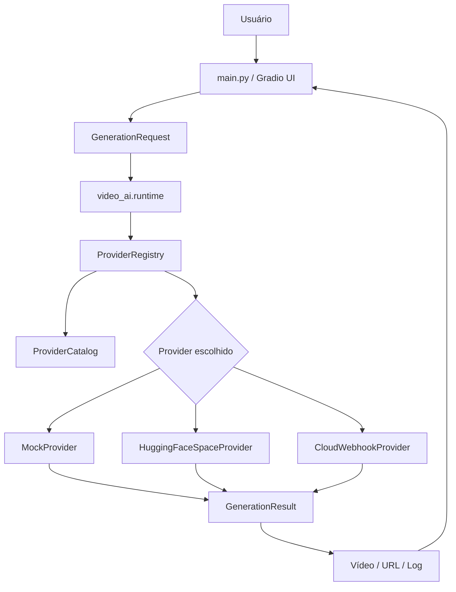

# Blueprint do Projeto — Video AI

## 1. Visão geral

O **Video AI** é uma interface GUI para gerar vídeos com inteligência artificial usando provedores em nuvem, modelos gratuitos/abertos e backends plugáveis.

A proposta é criar um **hub visual** onde o usuário possa:

1. escrever um prompt;
2. escolher um provedor/modelo;
3. configurar provedores pela própria interface;
4. enviar a geração para um backend local ou em nuvem;
5. visualizar o resultado;
6. futuramente reaproveitar presets, histórico e workflows.

O projeto começou como uma aplicação Python com **Gradio** e agora evoluiu para uma arquitetura com **catálogo central de provedores**, **registry runtime**, **manifesto de configuração/admin** e **interface com abas**.

---

## 2. Problema que o projeto resolve

Hoje existem muitos modelos e provedores de vídeo por IA, mas eles estão espalhados entre:

- Hugging Face Spaces;
- Google Colab;
- Kaggle;
- ComfyUI;
- SwarmUI;
- WanGP;
- APIs pagas ou semi-gratuitas;
- demos temporárias;
- provedores com fila, cota ou crédito grátis.

Cada solução tem interface, credenciais, parâmetros e formato de resposta próprios.

O **Video AI** resolve isso criando uma camada única de operação:

```txt
Usuário → Interface → Runtime → Registry → ProviderCatalog → Provedor → Resultado
```

Assim, o usuário pode trocar de provedor sem refazer a interface.

---

## 3. Decisão arquitetural principal

A decisão central do projeto passou a ser:

```txt
Interface → Runtime → ProviderRegistry → ProviderCatalog → Provider
```

Essa separação permite que o sistema cresça sem virar um bloco de condicionais dentro da interface.

### Responsabilidades

```txt
Interface
- Renderiza a GUI.
- Coleta prompt, imagem, resolução, duração e seed.
- Mostra vídeo e logs.
- Exibe abas de configuração e diagnóstico.

Runtime
- Fachada simples usada pela interface.
- Lista provedores.
- Executa geração.
- Limpa cache de provedores.

ProviderRegistry
- Carrega provedores somente quando usados.
- Mantém cache runtime.
- Resolve o provedor padrão.

ProviderCatalog
- Fonte central de metadados dos provedores.
- Declara capacidades, tipo de transporte, credenciais e status.

Provider
- Implementa a chamada real ao backend.
- Recebe GenerationRequest.
- Retorna GenerationResult.
```

---

## 4. Fluxo técnico atual



---

## 5. Interface atual

Arquivo principal:

```txt
main.py
```

O arquivo `app.py` foi mantido como ponto de entrada compatível:

```txt
python app.py
```

Ele apenas importa `build_app` de `main.py` e inicia a interface com as configurações carregadas.

### Abas atuais

#### 5.1 Gerar vídeo

Responsável pelo fluxo principal:

- escolher provedor;
- escrever prompt;
- escrever prompt negativo;
- enviar imagem de referência opcional;
- definir duração;
- definir largura e altura;
- definir seed;
- gerar vídeo;
- exibir resultado e log JSON.

#### 5.2 Provedores

Responsável pela configuração visual:

- `DEFAULT_PROVIDER`;
- `HF_SPACE_ID`;
- `HF_API_NAME`;
- `HF_TOKEN`;
- `CLOUD_WEBHOOK_URL`;
- `CLOUD_WEBHOOK_KEY`;
- campos futuros de Agnes;
- URL futura do ComfyUI;
- host e porta do Gradio.

Essa aba grava as alterações no `.env` usando o manifesto de configuração.

#### 5.3 Diagnóstico

Responsável por exibir:

- catálogo de provedores;
- status de implementação;
- tipo de transporte;
- capacidades;
- status de credencial;
- status de endpoint;
- snapshot da configuração carregada.

---

## 6. Arquivos centrais

### 6.1 `app.py`

Ponto de entrada compatível para execução simples.

```txt
app.py → main.build_app() → Gradio launch
```

### 6.2 `main.py`

Nova interface principal com abas.

Responsabilidades:

- renderizar a GUI;
- chamar `video_ai.runtime`;
- salvar configurações via `admin_config`;
- atualizar diagnóstico.

### 6.3 `video_ai/runtime.py`

Fachada usada pela interface.

Funções principais:

```txt
list_providers()
get_default_provider()
clear_provider_cache()
run_generation(provider_name, request)
```

### 6.4 `video_ai/provider_catalog.py`

Catálogo central dos provedores.

Define:

```txt
ProviderDescriptor
PROVIDER_CATALOG
IMPLEMENTED_PROVIDER_IDS
ALL_PROVIDER_IDS
```

### 6.5 `video_ai/providers/runtime_registry.py`

Registry runtime com lazy loading.

Responsável por:

- carregar provedores sob demanda;
- manter cache;
- limpar cache após mudança de configuração;
- executar geração.

### 6.6 `video_ai/admin_config.py`

Manifesto de configuração/admin.

Define:

```txt
ConfigSectionSpec
ConfigFieldSpec
SECTIONS
FIELDS
read_env_values()
write_env_values()
provider_status_rows()
admin_snapshot()
```

### 6.7 `video_ai/providers/base.py`

Contrato de geração.

Define:

```txt
GenerationRequest
GenerationResult
Provider
```

---

## 7. Provedores atuais

### 7.1 MockProvider

Arquivo:

```txt
video_ai/providers/mock.py
```

Função:

- testar a interface sem API;
- salvar um `.txt` com o prompt enviado;
- validar o fluxo de geração.

Status: implementado.

### 7.2 HuggingFaceSpaceProvider

Arquivo:

```txt
video_ai/providers/huggingface_space.py
```

Função:

- chamar um Hugging Face Space compatível com `gradio_client`;
- enviar o prompt para a rota configurada;
- interpretar a resposta como URL ou caminho de vídeo quando possível.

Status: implementado de forma genérica.

Limitação:

- cada Space pode ter parâmetros diferentes;
- para produção, serão necessários adaptadores específicos por Space/modelo.

### 7.3 CloudWebhookProvider

Arquivo:

```txt
video_ai/providers/cloud_webhook.py
```

Função:

- enviar JSON para um endpoint HTTP;
- conectar APIs gratuitas, Colab, Kaggle, n8n, RunPod, Vast ou servidor próprio;
- aceitar retorno com `video_url`, `video`, `url` ou `path`.

Status: implementado.

---

## 8. Provedores planejados

O catálogo já prevê provedores que ainda não têm adaptador final.

### 8.1 AgnesProvider

Objetivo:

- conectar uma API gratuita/externa de geração de vídeo;
- receber prompt/imagem;
- retornar vídeo.

Status: planejado.

### 8.2 ComfyUIProvider

Objetivo:

- enviar workflow JSON para ComfyUI local ou remoto;
- substituir prompt/imagem nos nós;
- aguardar a execução;
- baixar ou exibir o vídeo.

Status: planejado.

### 8.3 Colab/Kaggle via webhook

Objetivo:

- rodar notebook com GPU gratuita;
- expor endpoint temporário;
- conectar pelo CloudWebhookProvider.

Status: planejado.

### 8.4 Replicate/Fal fallback

Objetivo:

- fallback pago ou com créditos;
- usar quando velocidade/qualidade forem mais importantes do que gratuidade.

Status: planejado.

---

## 9. Modelo de configuração

A configuração é baseada em `.env`, mas agora pode ser editada pela aba **Provedores**.

Campos principais:

```env
DEFAULT_PROVIDER=mock
HF_SPACE_ID=
HF_API_NAME=/predict
HF_TOKEN=
CLOUD_WEBHOOK_URL=
CLOUD_WEBHOOK_KEY=
GRADIO_SERVER_NAME=127.0.0.1
GRADIO_SERVER_PORT=7860
PROVIDER_TIMEOUT_SECONDS=180
PROVIDER_MAX_CONCURRENCY=2
AGNES_API_KEY=
AGNES_BASE_URL=
COMFYUI_BASE_URL=http://127.0.0.1:8188
```

O `admin_config.py` mantém as seções e campos em uma estrutura declarativa para a interface.

---

## 10. Estrutura atual de pastas

```txt
video-ai/
├── app.py
├── main.py
├── README.md
├── BLUEPRINT.md
├── requirements.txt
├── .env.example
├── .gitignore
├── docs/
│   ├── provedores.md
│   └── arquitetura-runtime.md
└── video_ai/
    ├── __init__.py
    ├── admin_config.py
    ├── config.py
    ├── orchestrator.py
    ├── provider_catalog.py
    ├── runtime.py
    └── providers/
        ├── __init__.py
        ├── base.py
        ├── mock.py
        ├── huggingface_space.py
        ├── cloud_webhook.py
        ├── registry.py
        └── runtime_registry.py
```

Observação: `registry.py` foi uma tentativa inicial de registry mais tipado. O runtime atual usado pela interface é `runtime_registry.py`.

---

## 11. Estrutura futura sugerida

```txt
video-ai/
├── app.py
├── main.py
├── Dockerfile
├── docker-compose.yml
├── docs/
│   ├── provedores.md
│   ├── arquitetura-runtime.md
│   ├── workflows.md
│   └── deploy.md
├── examples/
│   ├── prompts/
│   └── workflows/
├── outputs/
├── data/
│   └── video_ai.sqlite3
└── video_ai/
    ├── app/
    │   └── gradio_app.py
    ├── config/
    │   ├── settings.py
    │   ├── paths.py
    │   └── provider_catalog.py
    ├── core/
    │   ├── request.py
    │   ├── result.py
    │   └── errors.py
    ├── providers/
    │   ├── base.py
    │   ├── registry.py
    │   ├── mock.py
    │   ├── huggingface_space.py
    │   ├── cloud_webhook.py
    │   ├── agnes.py
    │   └── comfyui.py
    ├── services/
    │   ├── history.py
    │   ├── downloader.py
    │   └── prompt_builder.py
    └── ui/
        ├── generate_tab.py
        ├── providers_tab.py
        └── diagnostics_tab.py
```

---

## 12. Modelo de dados futuro

### Tabela: generations

```txt
id
created_at
provider
model
prompt
negative_prompt
image_path
video_path
video_url
status
error_message
duration_seconds
width
height
seed
raw_response
```

### Tabela: presets

```txt
id
name
category
prompt_template
negative_prompt
width
height
duration_seconds
provider
created_at
updated_at
```

### Tabela: providers

```txt
id
provider_id
label
transport_type
is_enabled
requires_api_key
base_url
capabilities
notes
created_at
updated_at
```

---

## 13. Presets planejados

### 13.1 Institucional realista

Uso:

- obras;
- equipes trabalhando;
- cidade;
- infraestrutura;
- ações públicas.

### 13.2 Reels vertical

Configuração sugerida:

```txt
width: 576
height: 1024
duration: 5s a 8s
```

### 13.3 Notícia jornalística

Uso:

- transformar pauta em vídeo curto;
- estilo reportagem;
- cenas de apoio.

### 13.4 Evento institucional

Uso:

- workshop;
- inauguração;
- chamada de agenda;
- comunicação interna.

### 13.5 Imagem para vídeo

Uso:

- animar foto institucional;
- criar movimento suave;
- simular câmera;
- gerar vídeo a partir de card/foto.

---

## 14. Fluxo de geração ideal

```txt
1. Usuário escolhe preset ou escreve prompt livre.
2. Usuário escolhe provedor.
3. Interface monta GenerationRequest.
4. Runtime envia para ProviderRegistry.
5. ProviderRegistry carrega ou reutiliza o provedor.
6. Provider chama modelo/API.
7. Provider retorna GenerationResult.
8. Interface mostra vídeo e log.
9. Sistema salva histórico.
10. Usuário pode baixar, repetir ou ajustar.
```

---

## 15. Fluxo de fallback futuro

Quando um provedor falhar, o sistema poderá tentar outro automaticamente.

```txt
Hugging Face Space falhou
↓
Tentar Cloud Webhook
↓
Tentar Agnes
↓
Tentar ComfyUI local/remoto
↓
Tentar Replicate/Fal, se configurado
↓
Exibir erro final com log
```

Configuração futura:

```env
FALLBACK_PROVIDERS=huggingface_space,cloud_webhook,agnes,comfyui,replicate_fal
```

---

## 16. Deploy planejado

### 16.1 Local

```bash
python app.py
```

### 16.2 Hugging Face Spaces

Uso para disponibilizar a GUI na web.

Arquivos necessários:

```txt
app.py
main.py
requirements.txt
video_ai/
README.md
```

### 16.3 Docker

Arquivos planejados:

```txt
Dockerfile
docker-compose.yml
```

### 16.4 Servidor próprio

Uso futuro:

- rodar GUI;
- armazenar histórico;
- conectar a APIs externas;
- acoplar ComfyUI remoto;
- criar fila de geração.

---

## 17. Roadmap técnico atualizado

### Fase 1 — MVP funcional

- [x] Criar repositório.
- [x] Criar README inicial.
- [x] Criar GUI Gradio.
- [x] Criar configuração `.env`.
- [x] Criar contrato de provedores.
- [x] Criar MockProvider.
- [x] Criar HuggingFaceSpaceProvider.
- [x] Criar CloudWebhookProvider.
- [x] Criar documentação inicial de provedores.
- [x] Criar blueprint do projeto.

### Fase 2 — Arquitetura de provedores

- [x] Criar ProviderCatalog.
- [x] Criar ProviderDescriptor.
- [x] Criar ProviderRegistry runtime.
- [x] Criar runtime/fachada para interface.
- [x] Criar manifesto admin de configuração.
- [x] Criar aba Provedores.
- [x] Criar aba Diagnóstico.
- [x] Manter `python app.py` como entrada principal.

### Fase 3 — Primeiro provedor real

- [ ] Testar execução local com `mock`.
- [ ] Escolher um Hugging Face Space público de vídeo.
- [ ] Verificar assinatura real da API do Space.
- [ ] Criar adaptador específico para esse Space.
- [ ] Testar geração real de vídeo.
- [ ] Documentar limites, fila, erros e tempo médio.

### Fase 4 — Histórico e presets

- [ ] Adicionar SQLite.
- [ ] Salvar histórico de geração.
- [ ] Criar galeria simples.
- [ ] Criar presets institucionais.
- [ ] Permitir repetir geração a partir do histórico.

### Fase 5 — Workflows avançados

- [ ] Integrar ComfyUI.
- [ ] Adicionar suporte a workflow JSON.
- [ ] Adicionar imagem de referência real nos providers compatíveis.
- [ ] Criar fila de geração.
- [ ] Baixar vídeos gerados automaticamente.

### Fase 6 — Produto utilizável

- [ ] Docker.
- [ ] Deploy em Hugging Face Spaces.
- [ ] Deploy em servidor próprio.
- [ ] Autenticação opcional.
- [ ] Biblioteca de modelos testados.
- [ ] Exportação organizada dos vídeos.

---

## 18. Riscos e cuidados

### 18.1 Provedores grátis podem mudar

Camadas gratuitas podem ter:

- fila;
- limite diário;
- limite de GPU;
- watermark;
- bloqueio por uso excessivo;
- mudança de política;
- instabilidade.

Mitigação:

- manter múltiplos provedores;
- registrar logs;
- criar fallback;
- documentar provedores testados.

### 18.2 Cada modelo tem parâmetros diferentes

Alguns modelos exigem:

- prompt;
- imagem inicial;
- número de frames;
- resolução fixa;
- steps;
- guidance scale;
- seed;
- formato específico.

Mitigação:

- manter contrato genérico;
- usar `extra` para parâmetros específicos;
- criar adaptadores dedicados quando necessário.

### 18.3 Uso institucional

Para uso em comunicação pública ou institucional, verificar:

- licença do modelo;
- permissão de uso comercial;
- existência de watermark;
- privacidade das imagens enviadas;
- retenção dos arquivos pelo provedor.

---

## 19. Pendências técnicas conhecidas

- Testar execução local do app.
- Corrigir ou remover `video_ai/providers/registry.py`, que foi uma tentativa anterior e não é a versão usada pela interface.
- Atualizar `.env.example` com os novos campos quando o conector permitir.
- Atualizar README principal com a nova arquitetura quando o conector permitir.
- Criar testes mínimos para `provider_catalog`, `admin_config` e `runtime_registry`.

---

## 20. Critérios de sucesso

O projeto será considerado funcional quando conseguir:

1. abrir a GUI local sem erro;
2. gerar em modo `mock`;
3. salvar e recarregar configuração pela aba Provedores;
4. mostrar diagnóstico correto dos provedores;
5. conectar pelo menos um provedor real gratuito ou com camada grátis;
6. retornar um vídeo exibível na interface;
7. salvar histórico básico;
8. permitir trocar de provedor sem alterar a interface;
9. documentar claramente como configurar cada backend.

---

## 21. Comando de execução

```bash
git clone https://github.com/henrkecrz/video-ai.git
cd video-ai
python -m venv .venv
source .venv/bin/activate
pip install -r requirements.txt
cp .env.example .env
python app.py
```

No Windows:

```powershell
git clone https://github.com/henrkecrz/video-ai.git
cd video-ai
python -m venv .venv
.venv\Scripts\activate
pip install -r requirements.txt
copy .env.example .env
python app.py
```

---

## 22. Norte do produto

O Video AI não deve ser apenas um gerador fixo de vídeo. Ele deve evoluir para um **hub visual de geração de vídeos com IA**, capaz de conectar provedores gratuitos, workflows locais/remotos, APIs externas e presets institucionais em uma única interface.
